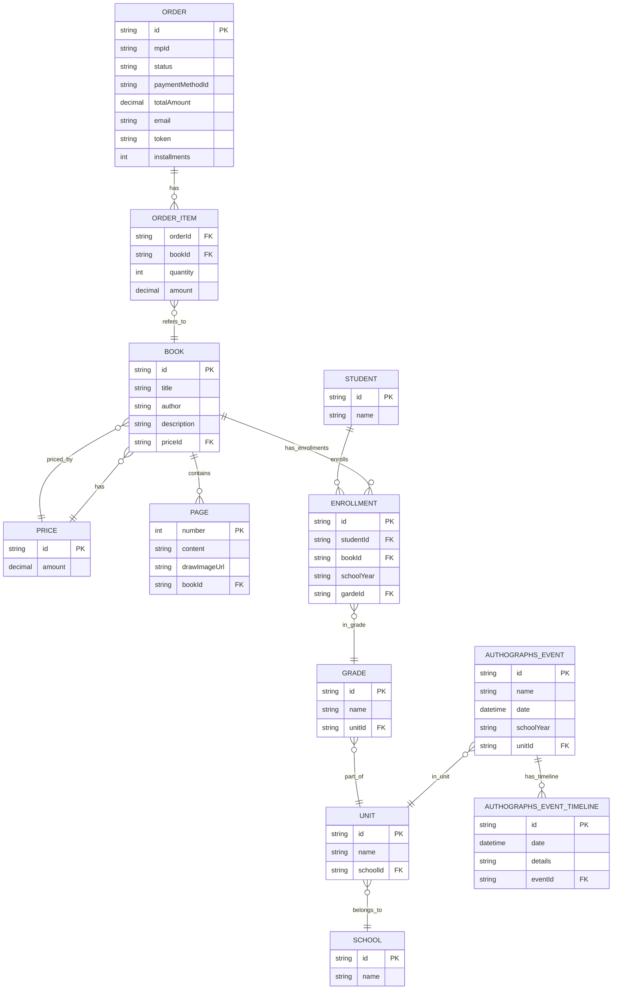

# `Turborepo` Vite starter

This is a community-maintained example. If you experience a problem, please submit a pull request with a fix. GitHub Issues will be closed.

## Using this example

Run the following command:

```sh
npx create-turbo@latest -e with-vite-react
```

## What's inside?

This Turborepo includes the following packages and apps:

### Apps and Packages

- `web`: react [vite](https://vitejs.dev) ts app
- `@repo/ui`: a stub component library shared by `web` application
- `@repo/eslint-config`: shared `eslint` configurations
- `@repo/typescript-config`: `tsconfig.json`s used throughout the monorepo

Each package and app is 100% [TypeScript](https://www.typescriptlang.org/).

### Utilities

This Turborepo has some additional tools already setup for you:

- [TypeScript](https://www.typescriptlang.org/) for static type checking
- [ESLint](https://eslint.org/) for code linting
- [Prettier](https://prettier.io) for code formatting

## Diagrama ER gerado a partir do schema Prisma

Abaixo está um diagrama Mermaid (ER) representando as entidades e relacionamentos definidos em `apps/api/prisma/schema.prisma`.


